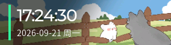
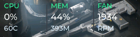
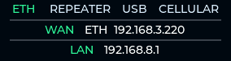
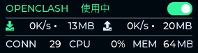

# ScreenPlus for GL-BE3600

ScreenPlus 是为 GL.iNet GL-BE3600（Slate 7）做的一套开源屏幕服务。直接接管设备自带的 284 × 76 彩色触摸屏，用更紧凑、更直观的方式展示路由器真正值得随手看一眼的信息：实时速率、连接数、设备状态、Wi-Fi、WAN/LAN 和 OpenClash。网络速率优先从 NSS/PPE 数据面计数器读取，不需要关闭硬件加速；不可用时自动回退到内核网卡计数器。屏幕支持翻转，壁挂安装时也能正常操作。

<p align="center">
  
</p>

## 页面一览

目前有六个页面，默认顺序是：首页、速率、系统状态、Wi-Fi、网络连接、OpenClash。页面可单独关闭，也可以在 LuCI 中调整顺序和显示字段。

### 首页

<p align="center">
  
</p>

只保留时间、日期和星期，简单干净。可以选择显示秒、时区。

### 实时速率

<p align="center">
  
</p>

固定位置显示上行、下行和实时连接数，右侧是最近 30 秒的流量趋势。数字和单位使用固定位置，实时变化时不会挤动布局。

### 系统状态

<p align="center">
  
</p>

显示 CPU 占用与温度、内存占用与已用空间，以及风扇转速。

### Wi-Fi

显示 2.4 GHz 和 5 GHz 的 SSID、开关状态与密码。密码支持隐藏、点击显示、始终显示和二维码模式；在页面内长按可以打开二维码，开始滑动后不会误触发。

### 网络连接

<p align="center">
  
</p>

页面会同时展示四种 WAN 来源的状态：

- Ethernet
- Wi-Fi Repeater
- USB Tethering
- Cellular

下方显示当前 WAN 类型、WAN IP 和 LAN IP。灰色表示接口不存在或没有连接，蓝色表示存在但没有启用，黄色表示已经启用但无法联网，主题色表示连接正常。

### OpenClash

<p align="center">
  
</p>

显示 OpenClash 状态、实时上下行速率、累计流量、连接数、CPU 和内存占用。右上角可以直接开关 OpenClash；启动或停止过程中会显示明确的“启动中 / 停止中”状态，并暂时锁定开关，避免重复操作。

## Reset 按键提示

按住机身 Reset 键时，屏幕会同步显示当前阶段和倒计时：

- 3 秒内松开：立即显示操作已取消，3 秒后返回原页面
- 3 秒以上、8 秒内：松开后重置网络
- 8 秒以上、20 秒内：松开后恢复整机设置
- 超过 20 秒：取消操作

时间规则跟随设备官方设置，ScreenPlus 不会修改系统原本的重置时长。

## LuCI 配置

安装后进入：

`系统 → ScreenPlus`

可以配置：

- ScreenPlus 开关、语言、亮度、息屏时间和屏幕方向
- 页面循环、自动轮播与滑动过渡
- Wi-Fi 密码展示方式
- 六个页面的顺序、启用状态和显示字段
- 主题色、主色、次要色、背景色、分割线和状态颜色
- 全局背景，或者每一页独立的背景图

Pages and content 使用六个页面 Tab，页面顺序单独放在上方。隐藏页面内容后，屏幕会按当前组合重新布局；保存设置时保持在正在查看的屏幕页面，不会强制回到首页。

背景图建议使用 284 × 76 px 的 PNG、JPEG、WebP 或 BMP，最大 10 MB。其他尺寸会在浏览器里居中裁切，再转换成固定大小的 RGB565 文件，上传后立即应用。没有设置背景时不显示预览占位。

## 官方屏幕一键切换

安装时 ScreenPlus 会停止并禁用官方 `gl_screen`，但不会删除它。

项目会把 ScreenPlus 加入 GL.iNet 原生 Toggle 设置。将机身侧面的拨动开关分配给 ScreenPlus 后，就可以在官方屏幕和 ScreenPlus 之间一键切换。卸载 ScreenPlus 时会自动恢复并启动官方屏幕服务。

## 安装

### 适用环境

- GL.iNet GL-BE3600 / Slate 7
- GL.iNet OpenWrt 23.05-SNAPSHOT
- 架构：`aarch64_cortex-a53_neon-vfpv4`

前往 [Releases](https://github.com/VAIO-Dong/gl-be3600-screenplus/releases) 下载最新的单一 IPK，上传到路由器后通过 SSH 安装：

```sh
opkg install screenplus_<version>-1_aarch64_cortex-a53_neon-vfpv4.ipk
```

一个 IPK 已经包含屏幕服务、LuCI 页面、菜单和 RPC 权限，不需要再单独安装 `luci-app-screenplus`。

> 项目目前主要在 GL-BE3600 原厂固件上开发和实机验证。升级或安装前，建议保留配置备份。

## 工作方式

ScreenPlus 是 C11 + LVGL 9.5.0 的原生程序，由 procd 管理：

- 直接输出到 `/dev/fb0`
- 直接读取 `/dev/input/event0`
- 通过 sysfs 控制背光
- CPU、内存来自 `/proc`
- 温度和风扇来自 thermal/hwmon sysfs
- 网络速率来自 NSS 数据面计数器或内核网卡计数器
- WAN/LAN、Wi-Fi 与页面配置来自 UCI
- OpenClash 信息来自本机进程和 loopback controller API

指标采集在后台线程中进行，界面线程只应用最新快照；滑动期间会暂停非必要的数据刷新，尽量让这块小屏幕保持跟手。

## 本地构建

Windows PowerShell：

```powershell
powershell -ExecutionPolicy Bypass -File scripts\bootstrap-toolchain.ps1
powershell -ExecutionPolicy Bypass -File scripts\build-prototype.ps1
powershell -ExecutionPolicy Bypass -File scripts\build-dev-ipk.ps1
```

生成结果：

```text
dist/screenplus_<version>-1_aarch64_cortex-a53_neon-vfpv4.ipk
```

本地构建使用项目固定的 LVGL 9.5.0 和 Zig ARM64/musl 交叉编译器。OpenWrt SDK 使用 [package/screenplus/Makefile](package/screenplus/Makefile)。

## 调试与贡献

仓库提供了可复用的设备工具：

- 触摸坐标监控、逻辑点击和滑动注入
- framebuffer 抓取与 RGB565 转 PNG
- 局部区域截图对比
- 字体覆盖检查和硬件测试程序

详细方法见 [设备测试文档](docs/DEVICE-TESTING.md) 和 [硬件记录](docs/HARDWARE.md)。如果你在其他固件版本、不同网络接入方式或不同 OpenClash 版本上测试，欢迎提交 Issue 或 PR。

## License

[MIT License](LICENSE)
